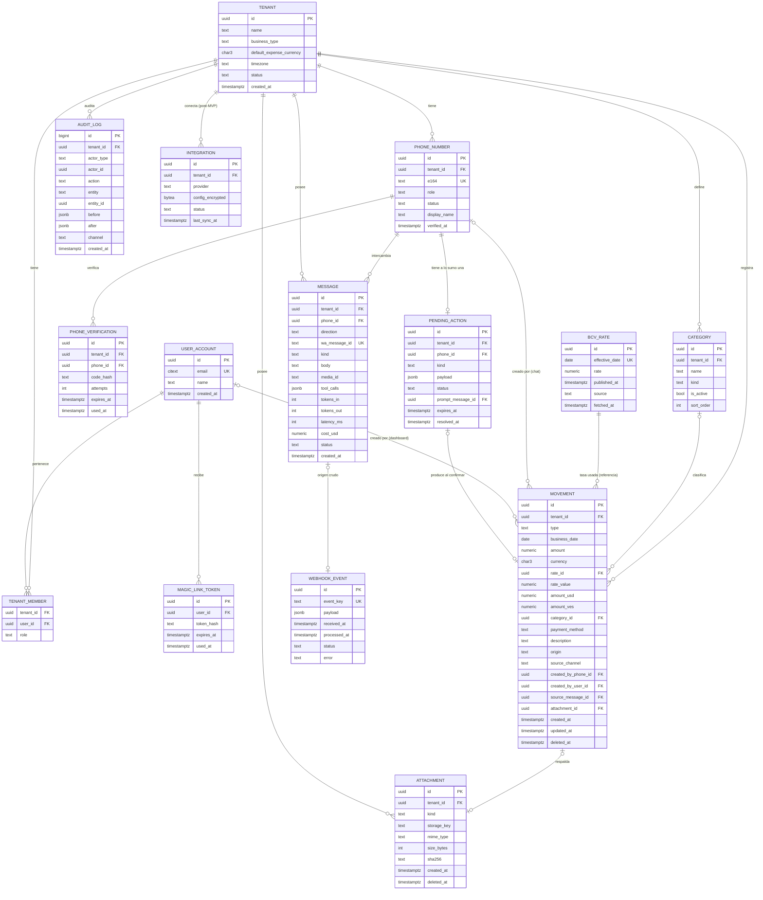

# Documento de Diseño del MVP

Asistente de caja por WhatsApp para pymes venezolanas.

Documento acumulativo. Cada fase agrega una sección al cerrarse.

| Fase | Estado |
|---|---|
| 0. Descubrimiento (Product Brief) | Aprobado |
| 1. Requerimientos | Aprobado |
| 2. Modelo de dominio y datos | Entregado, pendiente de aprobación |
| 3. Arquitectura | Pendiente |
| 4. UX conversacional | Pendiente |
| 5. UX/UI dashboard | Pendiente |
| 6. Stack tecnológico | Pendiente |
| 7. Seguridad, cumplimiento y riesgos | Pendiente |
| 8. Plan de ejecución | Pendiente |

---

## Fase 0. Product Brief

### Nombre de trabajo

Libro de caja por WhatsApp para pymes venezolanas.

Posicionamiento ante Meta y ante el cliente: sistema de registro de caja con interfaz de WhatsApp. No es un chatbot de IA de propósito general.

### Problema

El dueño de un negocio pequeño en Venezuela sabe cuánto gasta y cuánto vende, pero la información se pierde entre cuadernos, Excel y chats. Lo que se registra llega tarde, con la tasa BCV equivocada, en el día equivocado, o no llega. Al cierre del mes no sabe si ganó o perdió, y no puede analizar nada porque la data no es confiable.

Origen del problema (caso del fundador): autolavado con Odoo implementado. Los gastos se mandan por WhatsApp a la cajera y ella no los registra, o los registra con tasa o fecha equivocadas. La base de datos existe, la data no sirve.

### Usuario objetivo

- Dueño de negocio pequeño, 1 a 10 empleados: autolavado, bodega, ferretería pequeña, emprendimiento de comida, servicios.
- Lleva las cuentas en Excel o cuaderno. No tiene sistema administrativo.
- Opera en USD y Bs. Ejecuta la mayoría de los gastos en persona.
- Vive en WhatsApp. Nivel tecnológico bajo a medio. Muchos solo usan el teléfono.

Pilotos:
1. Autolavado del fundador (Odoo sigue haciendo POS e inventario; el asistente lleva los gastos y el cierre).
2. Emprendimiento de cinnamon rolls (pareja del fundador). Segmento distinto: pedidos, ingredientes, ventas por lote.

Sesgo conocido: ambos pilotos son del círculo del fundador. No validan la disposición a pagar de un desconocido.

### Propuesta de valor

Registras un gasto o la venta del día como le escribirías a tu cajera: texto, nota de voz o foto de la factura. El sistema lo guarda al momento, con la moneda original y la tasa BCV vigente ese día, y te devuelve el cierre del día y el resultado del mes cuando lo pidas, sin abrir nada. El dashboard existe para ver, corregir y exportar a Excel.

### Alcance del MVP (Must)

1. Registrar gasto: texto, nota de voz, foto de factura. Categoría, monto, moneda, tasa del día. Confirmación explícita antes de guardar.
2. Registrar ingreso: totales del día por método de pago (efectivo USD, efectivo Bs, Pago Móvil, punto, Zelle, otro). Transacciones sueltas opcionales.
3. Cierre del día y resultado del período: ingresos, gastos, diferencia, desglose por método y categoría. Cálculo determinista en backend, nunca en el LLM.
4. Consultas simples: "¿cuánto gasté en champú este mes?", "¿cuánto llevo vendido esta semana?".
5. Dashboard web mobile-first: ver, corregir, exportar a Excel. Onboarding del negocio y vinculación del número.
6. Tasa BCV automática diaria (cron, fuente principal más respaldo, distinguiendo "vigente hoy" de "última publicada"). Se expone como consulta porque cuesta cero.
7. Roles por número: dueño (todo) y empleado (registra, no consulta totales). Permiso mínimo, sin flujo propio.

### Fuera de alcance del MVP

- Inventario y stock.
- Presupuestos por categoría y "¿cuánto me queda?".
- Clientes, pedidos, CRM.
- Verificación de Pago Móvil (una captura no verifica nada; a lo sumo "registrado, pendiente de conciliar", y eso es iteración 2).
- Integración con Odoo. Vuelve como servicio premium con implementación cobrada aparte. El patrón adapter queda como costura, pero solo se implementa el proveedor local.
- Costo por carro o cualquier receta de insumos.
- Alertas proactivas por plantilla pagada (recordatorio de cierre, resumen automático a las 7 pm). Iteración 2.
- Bot de atención a clientes finales.
- Más de un número de WhatsApp por tenant.

### Métricas de éxito del piloto (30 días, autolavado)

- 100% de los gastos registrados el mismo día con la tasa BCV vigente, sin tocar Excel ni Odoo para eso.
- Cierre del día pedido al menos 5 de cada 7 días, y cuadra con el conteo de caja.
- Tiempo de revisión diaria del dueño baja al menos 30 minutos. Medir dos semanas antes y dos después.
- Mensajes que el bot no entendió o registró mal: menos del 5%, medido por correcciones hechas en el dashboard.

### Modelo de negocio (hipótesis)

- Suscripción mensual por negocio: 20 USD (hipótesis del fundador, sin análisis de mercado todavía).
- Restricción derivada: costo total por tenant (LLM + Meta + infra) por debajo de 5 USD al mes.
- Odoo como servicio premium: implementación y entrenamiento con cobro único, más la suscripción.
- Medio de cobro al cliente: por definir (Pago Móvil, Zelle, USDT).

### Restricciones del fundador

- Un solo desarrollador. Una semana libre a tiempo completo al inicio; después, horas parciales junto a un trabajo a tiempo completo.
- Presupuesto del piloto para infra, LLM (API) y Meta: se asume un techo de 30 a 50 USD al mes. Las suscripciones de herramientas de desarrollo (Claude, Gemini) no cuentan aquí.
- Se buscará reutilizar componentes de proyectos previos del fundador. Stack por confirmar en la Fase 6.

### Supuestos a validar

1. Un dueño sin sistema escribe los totales del día todos los días. Una fricción diaria es tolerable.
2. La nota de voz venezolana, con ruido de negocio, se transcribe con precisión utilizable.
3. Hay dueños fuera del círculo del fundador que pagan 20 USD al mes por esto.
4. Meta aprueba el número y el caso de uso como sistema de gestión, no como chatbot de IA. El texto vigente de la política debe verificarse antes de solicitar el número.
5. La verificación de negocio en Meta con documentos venezolanos se completa en un plazo razonable.

### Decisiones tomadas en la Fase 0

- Backend único del MVP: base de datos propia. Odoo sale del MVP y vuelve como premium.
- El fundador es el primer piloto sobre la base de datos propia. Su Odoo sigue intacto para POS.
- Producto = libro de caja por WhatsApp. No CRM, no inventario, no presupuestos.
- Ingresos por totales del día; transacción suelta opcional. El modelo de datos trata ambos como movimientos.
- Skill de tasa BCV se mantiene por costo cero, no como gancho.
- El usuario es el dueño. El rol empleado es un permiso, no un flujo.
- El cierre del día se calcula desde la base de datos, nunca interpretando un documento.
- Semana 1 = walking skeleton con el número de prueba de Meta (hasta 5 destinatarios): gastos por texto end-to-end y dashboard con lista y corrección. Voz, foto, ingresos y cierre en semanas 2 y 3.

### Preguntas abiertas

- Stack de los proyectos previos del fundador que se quieren reutilizar (Fase 6).
- Si la Cloud API soporta grupos hoy (verificar en la documentación de Meta). Diseño asume chat 1:1.
- Texto vigente de la política de IA de WhatsApp Business (verificar antes de solicitar el número).
- Créditos de API existentes en Anthropic o Google (Fase 6).
- Medio de cobro al cliente.

### Riesgos detectados

| Riesgo | Mitigación |
|---|---|
| El dueño no escribe el total del día y el cierre no existe | Recordatorio por plantilla en iteración 2; dashboard como respaldo |
| Pilotos sesgados (círculo del fundador) | Tercer piloto desconocido antes de la semana 8 |
| Transcripción de voz con ruido y jerga dispara la tasa de error | Siempre mostrar lo entendido y pedir confirmación antes de guardar |
| Verificación de Meta se demora semanas | Arrancar piloto con número de prueba; solicitar verificación en la semana 1 |
| Un solo número para todos los tenants: un bloqueo de Meta tumba a todos los clientes | Evaluar en Fase 7; respetar políticas al pie de la letra |
| Presión del piloto de cinnamon rolls hacia pedidos y clientes | Fuera de alcance explícito; anotar como backlog post-MVP |

---

## Fase 1. Requerimientos

### Convenciones

- Formato de historia: **Como** [rol], **quiero** [acción], **para** [beneficio]. Criterios en Dado / Cuando / Entonces.
- Roles: **Dueño** (todo), **Empleado** (registra gastos e ingresos, no consulta totales ni configura), **Sistema** (cron, webhooks).
- Prioridad MoSCoW. El MVP incluye solo los **Must**. Los Should son la iteración 2. Los Could no tienen fecha. Los Won't están descartados a propósito.
- Tamaño: S (menos de medio día), M (1 a 2 días), L (3 a 5 días). Estimación para un solo dev con asistencia de IA, ya con el walking skeleton hecho.
- Regla transversal a todas las historias de escritura: **el LLM no calcula ni inventa cifras**. Extrae campos; el backend valida, convierte con la tasa del día y guarda. Toda escritura pide confirmación explícita.

### Épica A. Onboarding y acceso

**US-A1. Registrar el negocio (Must, M).**
Como dueño, quiero crear mi negocio desde el dashboard, para empezar a registrar movimientos.
- Dado que entro al dashboard sin cuenta, cuando indico mi correo, entonces recibo un enlace de acceso (magic link) válido por 15 minutos.
- Dado que accedo por primera vez, cuando completo nombre del negocio, tipo, moneda de referencia (USD por defecto) y mi número de WhatsApp en formato internacional, entonces el sistema crea el tenant con zona horaria America/Caracas y categorías por defecto según el tipo de negocio.
- Dado que el número ya está vinculado a otro tenant, cuando intento registrarlo, entonces el sistema lo rechaza y me indica que un número solo puede pertenecer a un negocio.

**US-A2. Vincular mi número de WhatsApp (Must, M).**
Como dueño, quiero probar que ese número es mío, para que nadie registre gastos en mi negocio.
- Dado que registré mi número, cuando el dashboard me muestra un código de 6 dígitos y un botón "Abrir WhatsApp", entonces al enviar ese código desde ese número al número de la plataforma, el sistema marca el número como verificado y responde con el saludo de bienvenida.
- Dado que envío un código incorrecto, cuando lo recibe el sistema, entonces responde que el código no coincide, sin revelar a qué negocio pertenece el número.
- Dado que el código tiene más de 15 minutos, cuando lo envío, entonces el sistema lo rechaza y el dashboard permite generar uno nuevo.

**US-A3. Rechazar números desconocidos (Must, S).**
Como sistema, quiero responder a un número no vinculado con una instrucción breve, para no filtrar información ni gastar LLM.
- Dado que llega un mensaje de un número que no está en ningún tenant, cuando lo proceso, entonces respondo un texto fijo (sin LLM) con el enlace de registro y no guardo el contenido del mensaje.
- Dado que ese número escribe más de 5 veces en una hora, cuando llega el sexto mensaje, entonces no respondo (rate limit silencioso).

**US-A4. Agregar un empleado (Must, S).**
Como dueño, quiero agregar el número de un empleado con rol Empleado, para que registre gastos sin ver mis totales.
- Dado que agrego un número con rol Empleado, cuando ese número escribe por primera vez, entonces recibe el saludo y puede registrar gastos e ingresos.
- Dado que un Empleado pide el cierre del día o el resultado del mes, cuando lo proceso, entonces respondo que esa consulta es solo para el dueño.
- Dado que desactivo un número, cuando escribe, entonces recibe el mismo trato que un número desconocido.

### Épica B. Registrar gastos

**US-B1. Gasto por texto (Must, L).** *Historia núcleo del walking skeleton.*
Como dueño, quiero escribir "gasté 15$ en champú" y que quede registrado, para no depender de nadie.
- Dado que envío un texto con monto, moneda y concepto, cuando el sistema lo interpreta, entonces me muestra un resumen (monto, moneda, equivalente en la otra moneda a la tasa vigente, categoría sugerida, fecha) con botones **Guardar** / **Corregir** / **Cancelar**.
- Dado que toco Guardar, cuando el backend persiste, entonces el gasto queda con monto original, moneda original, tasa BCV de esa fecha, equivalente calculado por el backend, categoría, descripción, autor (número) y canal (texto), y recibo "Listo, guardado" con el total de gastos del día.
- Dado que toco Corregir, cuando respondo con el cambio ("eran 25", "es mantenimiento"), entonces el sistema actualiza el borrador y vuelve a pedir confirmación.
- Dado que toco Cancelar o pasan 10 minutos sin respuesta, cuando expira, entonces el borrador se descarta y no se guarda nada.
- Dado que el monto tiene decimales en formato venezolano ("15,50"), cuando lo interpreto, entonces se guarda 15.50 sin ambigüedad.

**US-B2. Moneda ambigua (Must, S).**
Como dueño, quiero que si escribo "gasté 500 en hielo" me pregunte la moneda, para que no adivine.
- Dado que el texto no indica moneda ni símbolo, cuando lo interpreto, entonces pregunto con dos botones: **USD** / **Bs**. No infiero por magnitud.
- Dado que el tenant configuró una moneda por defecto para gastos, cuando el texto no indica moneda, entonces uso esa moneda y la muestro claramente en el resumen antes de confirmar.

**US-B3. Gasto en bolívares (Must, S).**
- Dado que registro "pagué 1.200 bs de hielo", cuando confirmo, entonces se guarda 1200.00 VES, la tasa BCV vigente de la fecha y el equivalente en USD calculado por el backend con redondeo a 2 decimales (bankers no; redondeo half-up comercial).
- Dado que no hay tasa BCV para esa fecha (fin de semana, feriado), cuando calculo, entonces uso la última tasa vigente anterior y lo indico en el resumen: "a tasa del viernes 26/09".

**US-B4. Gasto con fecha pasada (Must, S).**
- Dado que escribo "ayer gasté 20$ en gasolina", cuando lo interpreto, entonces la fecha es la de ayer en America/Caracas y la tasa es la vigente ese día.
- Dado que la fecha es de hace más de 30 días o futura, cuando lo interpreto, entonces pido confirmación explícita de la fecha antes de mostrar el resumen.

**US-B5. Gasto por nota de voz (Must, M).**
- Dado que envío una nota de voz, cuando el sistema la transcribe, entonces me muestra la transcripción entre comillas y luego el mismo resumen con botones de US-B1.
- Dado que la transcripción no contiene un monto reconocible, cuando la proceso, entonces respondo "Entendí: '…'. No encontré el monto, ¿cuánto fue?" y espero.
- Dado que el audio dura más de 2 minutos, cuando lo recibo, entonces respondo que solo proceso audios cortos y pido que lo repita.
- Dado que se completó la transcripción, cuando termina el flujo, entonces el archivo de audio se elimina; solo se conserva la transcripción.

**US-B6. Gasto por foto de factura (Must, M).**
- Dado que envío una foto, cuando el sistema la analiza, entonces extrae total, moneda, fecha y proveedor si son legibles, y muestra el resumen con botones de US-B1. Los campos que no pudo leer los pide.
- Dado que la foto no parece una factura o recibo, cuando la analizo, entonces respondo que solo proceso fotos de facturas y recibos.
- Dado que confirmo el gasto, cuando se guarda, entonces la imagen se conserva asociada al movimiento como respaldo, en almacenamiento privado, visible en el dashboard.
- Dado que la factura tiene IVA desglosado, cuando extraigo, entonces el monto del gasto es el total pagado; el IVA no se modela por separado en el MVP.

**US-B7. Categorías (Must, S).**
- Dado que el tenant tiene una lista de categorías, cuando interpreto un gasto, entonces sugiero una de esa lista o "Otros"; nunca invento categorías nuevas desde el chat.
- Dado que el dueño escribe "eso va en insumos" al corregir, cuando "insumos" existe, entonces la asigno; si no existe, ofrezco la más parecida o "Otros" y le indico que puede crearla en el dashboard.

**US-B8. Corregir o borrar el último movimiento por chat (Must, M).**
- Dado que guardé un gasto hace menos de 30 minutos, cuando escribo "no, eran 25" o "bórralo", entonces el sistema identifica el último movimiento del autor, muestra el cambio y pide confirmación.
- Dado que confirmo un borrado, cuando se ejecuta, entonces es un borrado lógico (soft delete) que queda en el log de auditoría.
- Dado que el movimiento tiene más de 30 minutos, cuando pido corregirlo, entonces el sistema me remite al dashboard con el enlace directo al movimiento.

### Épica C. Registrar ingresos

**US-C1. Total del día por método de pago (Must, M).**
Como dueño, quiero escribir "hoy vendí 350$: 200 efectivo, 100 pago móvil, 50 punto", para cerrar el día en un mensaje.
- Dado que el texto tiene un total y un desglose, cuando lo interpreto, entonces valido en backend que el desglose suma el total; si no cuadra, muestro la diferencia y pido corrección.
- Dado que el desglose cuadra, cuando confirmo, entonces se crea un movimiento de ingreso por cada método, todos con la misma fecha y la tasa vigente.
- Dado que solo escribo un total sin desglose, cuando lo interpreto, entonces guardo un único ingreso con método "Sin especificar" y lo indico.
- Dado que un método está en Bs ("400 mil bs de pago móvil") y otro en USD, cuando confirmo, entonces cada movimiento guarda su moneda original y el total del día se muestra en ambas monedas.

**US-C2. Ingreso suelto (Must, S).**
- Dado que escribo "me pagaron 20$ por zelle del carro rojo", cuando confirmo, entonces se guarda un ingreso individual con método Zelle y descripción.

**US-C3. Día ya cerrado (Must, S).**
- Dado que ya registré el total de hoy, cuando envío otro total para hoy, entonces el sistema pregunta con botones: **Reemplazar** el total anterior / **Agregar** a lo ya registrado / **Cancelar**.
- Dado que elijo Reemplazar, cuando se ejecuta, entonces los ingresos anteriores de ese día con origen "total del día" quedan con borrado lógico y auditados.

### Épica D. Cierre y consultas

**US-D1. Cierre del día (Must, M).**
Como dueño, quiero escribir "cierre" o "cómo fue hoy", para ver en un mensaje ingresos, gastos y resultado.
- Dado que pido el cierre, cuando el backend lo calcula, entonces recibo: ingresos por método, gastos por categoría, resultado (ingresos menos gastos), todo en USD y en Bs a la tasa vigente del día, y el conteo de movimientos.
- Dado que no hay movimientos ese día, cuando pido el cierre, entonces respondo "No tengo movimientos registrados hoy" y no muestro ceros que parezcan un cierre real.
- Dado que soy Empleado, cuando pido el cierre, entonces recibo el rechazo de US-A4.

**US-D2. Resultado del período (Must, M).**
- Dado que pido "cómo va el mes", "esta semana" o "del 1 al 15", cuando el backend lo calcula, entonces recibo el mismo formato de US-D1 agregado por el período, más los 5 gastos más grandes.
- Dado que el período supera 12 meses, cuando lo pido, entonces respondo que por chat solo consulto hasta 12 meses y remito al dashboard.

**US-D3. Consulta por categoría (Must, S).**
- Dado que pregunto "cuánto gasté en champú este mes", cuando el backend consulta, entonces respondo el total en ambas monedas y la cantidad de movimientos; si la categoría no existe, ofrezco las más parecidas.

**US-D4. Tasa BCV (Must, S).**
- Dado que pregunto la tasa, cuando la consulto, entonces respondo la tasa **vigente hoy** con su fecha; si el BCV ya publicó la del siguiente día hábil, la agrego como "próxima" con su fecha de vigencia.
- Dado que la tasa vigente tiene más de 3 días hábiles de antigüedad, cuando la respondo, entonces agrego una advertencia de que puede estar desactualizada.

### Épica E. Dashboard

**US-E1. Acceso (Must, S).** Magic link por correo (ver US-A1). Sesión de 30 días en el dispositivo. Cierre de sesión.

**US-E2. Movimientos (Must, M).**
- Dado que entro a Movimientos, cuando cargo la vista, entonces veo la lista del mes actual, más reciente primero, con tipo, fecha, descripción, categoría, monto original, equivalente, autor y canal; filtros por tipo, categoría, rango de fechas y autor.
- Dado que edito un movimiento, cuando guardo, entonces se registra en auditoría quién, cuándo y qué cambió; si cambio la fecha, la tasa se recalcula a la de la nueva fecha y se me advierte.
- Dado que elimino un movimiento, cuando confirmo, entonces es borrado lógico y puedo verlo con el filtro "Eliminados".

**US-E3. Exportar (Must, S).**
- Dado que elijo un rango, cuando exporto, entonces descargo un archivo .xlsx con una fila por movimiento y columnas: fecha, tipo, categoría, descripción, monto, moneda, tasa, equivalente USD, equivalente Bs, método, autor, canal.

**US-E4. Resumen del mes (Must, S).** Ingresos, gastos, resultado, por categoría y por método, en ambas monedas. Sin gráficos complejos en el MVP: tablas y un par de totales grandes.

**US-E5. Categorías (Must, S).** Crear, renombrar, desactivar. No se borran si tienen movimientos.

**US-E6. Números y roles (Must, S).** Agregar, desactivar, cambiar rol. Ver estado de verificación.

**US-E7. Configuración (Must, S).** Moneda por defecto para gastos, nombre del negocio, tipo.

### Épica F. Plataforma

**US-F1. Tasa BCV diaria (Must, M).**
- Dado el cron diario, cuando corre, entonces consulta la fuente principal, y si falla, la de respaldo; guarda tasa, fecha de vigencia, fecha de publicación y fuente.
- Dado que ambas fuentes fallan, cuando corre, entonces reintenta cada hora y registra una alerta; las conversiones usan la última tasa vigente conocida y lo indican.
- Dado que el BCV publicó por adelantado la tasa del próximo día hábil, cuando la guardo, entonces queda con su fecha de vigencia futura y no se usa antes de esa fecha.

**US-F2. Fuera de alcance (Must, S).**
- Dado que el mensaje no corresponde a ninguna función (chiste, pregunta general, redactar algo), cuando lo proceso, entonces respondo un texto fijo: qué sí puedo hacer, con un menú de 3 botones (Registrar gasto, Registrar venta, Ver cierre). Sin conversación libre.

**US-F3. Idempotencia y reintentos (Must, M).**
- Dado que Meta reenvía un webhook ya procesado, cuando lo recibo, entonces lo reconozco por el id del mensaje y no lo proceso dos veces ni respondo dos veces.
- Dado que el webhook llega, cuando lo recibo, entonces respondo 200 en menos de 1 segundo y proceso en segundo plano.

**US-F4. Auditoría (Must, S).**
- Toda escritura (crear, editar, borrar, cambiar rol, vincular número) registra: tenant, actor, acción, entidad, valores antes y después, canal, timestamp.

**US-F5. Fallo del LLM o del proveedor de voz/visión (Must, S).**
- Dado que el proveedor no responde en 20 segundos o devuelve error, cuando falla, entonces respondo "Ahora mismo no puedo procesar esto, inténtalo en unos minutos" y **no** reintento la escritura en silencio. El mensaje queda marcado como fallido para métricas.

### Should (iteración 2)

| ID | Historia | Tamaño |
|---|---|---|
| S-1 | Recordatorio de cierre a hora configurable (plantilla de utilidad pagada) | M |
| S-2 | Resumen del día automático a las 7 pm (plantilla) | S |
| S-3 | Pago Móvil desde captura: registro como "pendiente de conciliar" con referencia, y lista de pendientes en el cierre | L |
| S-4 | Login al dashboard con código por WhatsApp (el usuario pide el código, respuesta en ventana de servicio) | M |
| S-5 | Importar movimientos desde Excel (onboarding de quien ya tiene su hoja) | M |
| S-6 | Presupuesto mensual por categoría y alerta al 80% | M |
| S-7 | Gráficos en el resumen del mes | S |

### Could

| ID | Historia |
|---|---|
| C-1 | Inventario básico: producto, stock, costo, precio, consulta por chat |
| C-2 | Integración Odoo (lectura de ventas del POS para el cierre; escritura de gastos) como premium |
| C-3 | Exportación contable (formato para el contador) |
| C-4 | Múltiples negocios por dueño con selector |

### Won't (MVP y siguiente iteración)

CRM, pedidos, clientes. Bot de atención a clientes finales. Verificación bancaria de pagos. Más de un número de WhatsApp por tenant. Facturación fiscal. Nómina. Multi-idioma.

### Requerimientos no funcionales

| Área | Requerimiento | Nota |
|---|---|---|
| Latencia, texto | p50 menor a 5 s, p95 menor a 12 s desde que Meta entrega el webhook hasta que enviamos la respuesta | Incluye una llamada al LLM con tool-calling. Si supera 4 s, enviar indicador de "escribiendo" (verificar soporte vigente en la Cloud API) |
| Latencia, voz y foto | p95 menor a 25 s | Transcripción u OCR más LLM. Enviar acuse inmediato: "Recibí tu nota de voz, dame un momento" |
| Webhook | Responder 200 en menos de 1 s, siempre, incluso si la base de datos está caída | Encolar antes de procesar. Meta reintenta si no recibe 200 y termina desactivando el webhook |
| Disponibilidad | 99% mensual en el MVP (unas 7 h de caída al mes) | Un solo servidor es aceptable. El dashboard puede caer sin afectar al bot y viceversa |
| Costo por tenant | Menor a 5 USD al mes con 300 mensajes al mes (60% texto, 25% voz, 15% foto) | Reparto objetivo: LLM 2, voz y visión 1, Meta 0.5, infra prorrateada 1.5. Todos los precios a verificar en Fase 6 |
| Conversaciones Meta | Todas iniciadas por el usuario (ventana de servicio). Cero plantillas en el MVP | Verificar precio vigente de conversaciones de servicio; ha cambiado varias veces |
| Precisión monetaria | Decimales exactos (NUMERIC), nunca float. Montos con 2 decimales, tasa con 4 | Redondeo half-up comercial en conversiones |
| Zona horaria | Todo en America/Caracas para fechas de negocio; almacenamiento en UTC con fecha de negocio explícita | "Hoy" se decide en hora de Caracas, no del servidor |
| Seguridad | Firma X-Hub-Signature-256 en cada webhook; secretos cifrados en reposo; aislamiento por tenant en cada consulta; rate limit por número; sesiones con expiración | Detalle en Fase 7 |
| Auditoría | Toda escritura auditada, con retención de 12 meses mínimo | |
| Conectividad inestable | Mensajes cortos; respuestas que no dependen de imágenes ni enlaces; el bot funciona sin el dashboard | WhatsApp ya reintenta del lado del cliente |
| Idempotencia | Por id de mensaje de Meta; retención de ids 7 días | |
| Medios | Audio se borra tras transcribir; fotos de facturas se conservan en almacenamiento privado con enlaces firmados | Retención de fotos: 12 meses, luego a decidir |
| Observabilidad | Por cada mensaje: tenant, tipo, herramienta invocada, tokens, latencia por etapa, costo estimado, resultado | Es lo que alimenta la métrica de costo por tenant |
| LLM | Proveedor principal más uno de respaldo detrás de una interfaz común. Timeout 20 s. Sin reintento de escrituras | El respaldo puede ser de menor calidad; solo importa que responda |
| Guardrails | Lista cerrada de herramientas; rechazo fijo fuera de alcance; el LLM nunca produce cifras que no vengan de una herramienta | Requisito de la política de Meta y de la regla 4 |
| Backups | Base de datos con respaldo diario y prueba de restauración mensual | |

### Backlog priorizado del MVP (orden de construcción)

| Orden | Historias | Justificación |
|---|---|---|
| 1 | US-F3, US-A3, US-B1 (texto), US-F1, US-E1, US-E2 (solo lista) | Walking skeleton: un gasto por texto llega a la base de datos y se ve en el dashboard |
| 2 | US-A1, US-A2, US-A4, US-B2, US-B3, US-B4, US-B7, US-F2, US-F4, US-F5 | Onboarding real y robustez del flujo de gasto |
| 3 | US-C1, US-C2, US-C3, US-D1, US-D4 | Ingresos y cierre: el producto ya "cierra el día" |
| 4 | US-B5 (voz), US-B6 (foto), US-B8 | Canales de entrada que hacen al producto amigable |
| 5 | US-D2, US-D3, US-E2 (edición), US-E3, US-E4, US-E5, US-E6, US-E7 | Consultas y dashboard completo |

### Decisiones tomadas en la Fase 1

- Confirmación de escrituras con botones interactivos de WhatsApp (Guardar / Corregir / Cancelar), no con texto libre "sí".
- Moneda ambigua se pregunta, nunca se infiere por magnitud. Moneda por defecto configurable por tenant.
- Borrador de escritura expira a los 10 minutos. Corrección por chat solo dentro de 30 minutos; después, dashboard.
- Borrados siempre lógicos y auditados.
- Ingresos como movimientos: un total del día genera un movimiento por método.
- Login al dashboard por magic link de correo. Login por WhatsApp es Should.
- Audio se descarta tras transcribir. Fotos de facturas se conservan como respaldo.
- Ante fallo del LLM, se informa y no se reintenta la escritura en silencio.
- IVA no se modela en el MVP; el gasto es el total pagado.
- Sin plantillas pagadas en el MVP.

### Preguntas abiertas (resueltas al aprobar la fase)

1. Categorías por defecto por tipo de negocio: se definen en Fase 4 con los guiones.
2. El Empleado registra gastos e ingresos; solo el dueño ve totales. Aprobado.
3. Retención de fotos de facturas: 12 meses. Aprobado, y se comunica como valor agregado.
4. Límites de botones (3) y listas (10 filas) interactivas: se asumen esos valores y se validan en pruebas con el número de prueba durante la semana 1.

### Riesgos detectados

- La latencia de voz y foto (hasta 25 s) puede sentirse como "no funciona". Mitigación: acuse inmediato antes de procesar.
- El presupuesto de 5 USD por tenant depende de precios de LLM, voz y Meta que cambian. Mitigación: medir costo por mensaje desde el walking skeleton.
- Desglose de ingresos que no cuadra con el total es el error humano más probable. Mitigación: validación aritmética en backend con mensaje claro, nunca guardar sin cuadrar.
- Fuera de alcance mal calibrado: si el rechazo es demasiado agresivo, el dueño se frustra ("gasté en algo raro" rechazado). Mitigación: evals de conversación en Fase 8 con casos límite.

---

## Fase 2. Modelo de dominio y datos

### Principios

1. **El dinero nunca es float.** `NUMERIC` en Postgres, `Decimal` o enteros escalados en código. Montos con 2 decimales; tasa con 8 decimales porque el BCV publica hasta 8.
2. **Cada movimiento congela su contexto monetario.** Guarda monto y moneda originales, la tasa usada (valor copiado, no solo la referencia) y los equivalentes en USD y Bs calculados en el momento de escribir. Si mañana se corrige una tasa en la tabla, la historia no cambia sola.
3. **Fecha de negocio explícita.** `business_date` es un `DATE` en hora de Caracas y es la fecha que el dueño entiende. `created_at` es `timestamptz` en UTC y sirve para auditoría. Nunca se deriva una de la otra en consultas.
4. **Borrado lógico en todo lo que tenga valor económico.** `deleted_at` más auditoría. El borrado físico solo existe para medios (audio) y tokens.
5. **Todo tiene `tenant_id`.** Incluso donde parece redundante. Es lo que permite que la política de aislamiento sea uniforme.
6. **La moneda de referencia del MVP es USD.** Los totales y reportes se agregan en USD. Bs se muestra convertido a la tasa de la fecha del reporte, y por separado se muestra el "efectivo en Bs" real para cuadrar caja. Ver "Manejo bimonetario".

### Estrategia multi-tenant: row-level con `tenant_id` y RLS

**Opciones evaluadas**

| Criterio | A) Row-level: `tenant_id` en cada tabla + Row Level Security de Postgres | B) Schema por tenant | C) Base de datos por tenant |
|---|---|---|---|
| Migraciones | Una vez | Una por schema (200 tenants = 200 migraciones por cambio) | Una por base |
| Pool de conexiones | Compartido, simple | Compartido, pero con `search_path` por request; los ORM lo manejan mal | Un pool por base; inviable con 200 |
| Aislamiento | Lógico, reforzado por RLS en la base | Lógico por schema | Físico |
| Consultas cruzadas (métricas del negocio, costo por tenant) | Triviales | Dolorosas | Muy dolorosas |
| Exportar o borrar un tenant | `WHERE tenant_id = ?` | `DROP SCHEMA` | `DROP DATABASE` |
| Riesgo de fuga | Una consulta sin filtro. RLS lo bloquea aunque el código falle | Un `search_path` mal puesto | Bajo |
| Complejidad para un solo dev | Baja | Media-alta | Alta |
| Escala razonable | Miles de tenants | Cientos | Decenas |

**Decisión: A.** Row-level con `tenant_id NOT NULL` en todas las tablas de negocio, índices compuestos que empiezan por `tenant_id`, y **RLS activado** con una política por tabla que compara contra `current_setting('app.tenant_id')`. La aplicación abre cada transacción con `SET LOCAL app.tenant_id = '<uuid>'`. El rol de base de datos de la aplicación no tiene `BYPASSRLS`; solo el rol de migraciones y el de cron lo tienen.

Por qué no B: schema por tenant se justifica cuando los tenants tienen esquemas distintos o exigencias contractuales de aislamiento. Aquí tienen el mismo esquema, pagan 20 USD y hay un dev. Las 200 migraciones por cambio son el costo que lo mata. Por qué no C: obvio a esta escala.

Consecuencia: RLS es una **red de seguridad**, no el filtro principal. El código sigue filtrando por `tenant_id` explícitamente. Si el código olvida el filtro, RLS devuelve cero filas en lugar de filas ajenas. Se prueba con un test de integración que intenta leer un tenant desde otro.

### Manejo bimonetario y precisión

**Al escribir un movimiento**

1. Se recibe `amount` y `currency` (USD o VES) desde el flujo de confirmación.
2. Se resuelve la tasa vigente para `business_date`: la fila de `bcv_rate` con mayor `effective_date <= business_date`. Si no existe ninguna, la escritura falla con un error claro (no se inventa una tasa).
3. Se calculan `amount_usd` y `amount_ves` con redondeo half-up a 2 decimales. Si `currency = USD`, `amount_usd = amount`; si `currency = VES`, `amount_ves = amount`. El otro se calcula.
4. Se guarda `rate_value` copiado y `rate_id` como referencia.

**Al editar** monto, moneda o fecha desde el dashboard, se recalcula todo con la tasa de la nueva fecha, y el dashboard advierte antes de guardar.

**Al reportar**

- Los totales se suman en USD (`SUM(amount_usd)`), que es la unidad de cuenta.
- El equivalente en Bs del total se calcula como `total_usd × tasa de la fecha del reporte`, no como `SUM(amount_ves)`. Sumar Bs de fechas distintas a tasas distintas produce un número que no significa nada.
- Aparte, para cuadrar caja, se muestra el efectivo real por moneda: suma de `amount` original agrupada por `payment_method` y `currency`. "Efectivo Bs: 1.850.000, Efectivo USD: 120, Pago Móvil: 3.400.000 Bs".

**Tipos**

| Campo | Tipo | Razón |
|---|---|---|
| `amount` (original) | `NUMERIC(18,2)` | Bs puede tener muchas cifras; 18 aguanta cualquier reconversión |
| `amount_usd` | `NUMERIC(14,2)` | |
| `amount_ves` | `NUMERIC(18,2)` | |
| `rate_value` | `NUMERIC(18,8)` | El BCV publica con hasta 8 decimales |
| `currency` | `CHAR(3)` con CHECK en (`USD`, `VES`) | ISO 4217. Se usa VES, no "Bs", en la base |

Redondeo: half-up comercial (`ROUND_HALF_UP`), nunca el redondeo bancario por defecto de algunos lenguajes. Se fija en una sola función de dominio (`convert(amount, currency, rate)`) y se prueba con casos de borde (0.005, montos grandes en Bs).

### Diagrama ER



### Entidades, una línea cada una

| Entidad | Qué es | Notas |
|---|---|---|
| `tenant` | El negocio | `business_type` alimenta categorías por defecto. `status`: `active`, `suspended`, `trial` |
| `user_account` | Persona que entra al dashboard | Identidad por correo. Separada de `phone_number` a propósito |
| `tenant_member` | Relación persona-negocio con rol de dashboard | MVP: solo `owner`. Deja lista la opción "varios negocios por dueño" |
| `phone_number` | Identidad de WhatsApp dentro de un tenant | `e164` único global: un número pertenece a un solo tenant (decisión 1). `role`: `owner`, `employee`. `status`: `pending`, `active`, `disabled` |
| `phone_verification` | Código de vinculación | Hash del código, 3 intentos, 15 minutos |
| `category` | Categoría de gasto (y de ingreso, reservado) | `kind`: `expense`, `income`. Desactivar, no borrar |
| `bcv_rate` | Una tasa por fecha de vigencia | Global, no por tenant. "Vigente hoy" = mayor `effective_date <= hoy`. "Última publicada" = mayor `effective_date` |
| `movement` | El corazón: un gasto o un ingreso | Ver campos abajo |
| `attachment` | Foto de factura (y audio transitorio) | `storage_key` apunta a almacenamiento privado. Audio se borra al terminar el flujo |
| `webhook_event` | Payload crudo de Meta | `event_key` único = idempotencia en la puerta. Permite reprocesar. Retención 7 días |
| `message` | Mensaje normalizado, entrante o saliente | Memoria de conversación (últimos N por teléfono) y observabilidad (tokens, latencia, costo) |
| `pending_action` | El borrador esperando Guardar / Corregir / Cancelar | A lo sumo una activa por teléfono. `kind`: `create_expense`, `create_income`, `edit_last`, `delete_last`, `replace_day_total`. Expira a 10 min |
| `audit_log` | Quién hizo qué | Escritura en la misma transacción que el cambio |
| `integration` | Conexión externa (Odoo, post-MVP) | Config cifrada. Es la tabla que respalda el adapter cuando exista un segundo proveedor |
| `magic_link_token` | Token de acceso al dashboard | Hash, un uso, 15 min |

**Campos de `movement` que merecen explicación**

- `type`: `expense` o `income`.
- `origin`: `single` (un gasto o un ingreso suelto) o `day_total` (generado por "hoy vendí…"). Permite "Reemplazar el total del día" sin tocar los ingresos sueltos.
- `payment_method`: `cash_usd`, `cash_ves`, `pago_movil`, `punto`, `zelle`, `transfer_usd`, `transfer_ves`, `other`, `unspecified`. Enum en el MVP; tabla por tenant cuando alguien lo pida. Obligatorio en ingresos, opcional en gastos.
- `source_channel`: `text`, `voice`, `image`, `dashboard`. Alimenta la métrica de error por canal.
- `created_by_phone_id` o `created_by_user_id`: exactamente uno no nulo (CHECK).
- `source_message_id`: el mensaje de WhatsApp que lo originó. Trazabilidad completa desde el chat hasta la fila.
- `attachment_id`: la foto de la factura, si la hubo.

### Esquema inicial (DDL, Postgres 16+)

Solo las tablas centrales; el resto sigue el mismo patrón. Los nombres están en inglés porque el código lo estará; el producto habla español.

```sql
CREATE EXTENSION IF NOT EXISTS citext;
CREATE EXTENSION IF NOT EXISTS pgcrypto;

CREATE TABLE tenant (
  id                        uuid PRIMARY KEY DEFAULT gen_random_uuid(),
  name                      text NOT NULL,
  business_type             text NOT NULL,                 -- car_wash, food, retail, services, other
  default_expense_currency  char(3) CHECK (default_expense_currency IN ('USD','VES')),
  timezone                  text NOT NULL DEFAULT 'America/Caracas',
  status                    text NOT NULL DEFAULT 'trial' CHECK (status IN ('trial','active','suspended')),
  created_at                timestamptz NOT NULL DEFAULT now()
);

CREATE TABLE phone_number (
  id            uuid PRIMARY KEY DEFAULT gen_random_uuid(),
  tenant_id     uuid NOT NULL REFERENCES tenant(id),
  e164          text NOT NULL UNIQUE,                       -- un número, un tenant
  role          text NOT NULL CHECK (role IN ('owner','employee')),
  status        text NOT NULL DEFAULT 'pending' CHECK (status IN ('pending','active','disabled')),
  display_name  text,
  verified_at   timestamptz,
  created_at    timestamptz NOT NULL DEFAULT now()
);
CREATE INDEX ON phone_number (tenant_id);

CREATE TABLE bcv_rate (
  id              uuid PRIMARY KEY DEFAULT gen_random_uuid(),
  effective_date  date NOT NULL UNIQUE,
  rate            numeric(18,8) NOT NULL CHECK (rate > 0),  -- VES por 1 USD
  published_at    timestamptz,
  source          text NOT NULL,                            -- 'bcv', 'backup_x'
  fetched_at      timestamptz NOT NULL DEFAULT now()
);

CREATE TABLE category (
  id          uuid PRIMARY KEY DEFAULT gen_random_uuid(),
  tenant_id   uuid NOT NULL REFERENCES tenant(id),
  name        text NOT NULL,
  kind        text NOT NULL DEFAULT 'expense' CHECK (kind IN ('expense','income')),
  is_active   boolean NOT NULL DEFAULT true,
  sort_order  int NOT NULL DEFAULT 0,
  UNIQUE (tenant_id, kind, name)
);

CREATE TABLE movement (
  id                   uuid PRIMARY KEY DEFAULT gen_random_uuid(),
  tenant_id            uuid NOT NULL REFERENCES tenant(id),
  type                 text NOT NULL CHECK (type IN ('expense','income')),
  business_date        date NOT NULL,
  amount               numeric(18,2) NOT NULL CHECK (amount > 0),
  currency             char(3) NOT NULL CHECK (currency IN ('USD','VES')),
  rate_id              uuid NOT NULL REFERENCES bcv_rate(id),
  rate_value           numeric(18,8) NOT NULL,              -- copia congelada
  amount_usd           numeric(14,2) NOT NULL,
  amount_ves           numeric(18,2) NOT NULL,
  category_id          uuid REFERENCES category(id),
  payment_method       text NOT NULL DEFAULT 'unspecified'
                       CHECK (payment_method IN ('cash_usd','cash_ves','pago_movil','punto','zelle',
                                                 'transfer_usd','transfer_ves','other','unspecified')),
  description          text,
  origin               text NOT NULL DEFAULT 'single' CHECK (origin IN ('single','day_total')),
  source_channel       text NOT NULL CHECK (source_channel IN ('text','voice','image','dashboard')),
  created_by_phone_id  uuid REFERENCES phone_number(id),
  created_by_user_id   uuid REFERENCES user_account(id),
  source_message_id    uuid REFERENCES message(id),
  attachment_id        uuid REFERENCES attachment(id),
  created_at           timestamptz NOT NULL DEFAULT now(),
  updated_at           timestamptz NOT NULL DEFAULT now(),
  deleted_at           timestamptz,
  CHECK ((created_by_phone_id IS NULL) <> (created_by_user_id IS NULL)),
  CHECK (type = 'expense' OR payment_method <> 'unspecified' OR origin = 'day_total')
);
-- La consulta más frecuente: movimientos vivos de un tenant en un rango de fechas
CREATE INDEX movement_tenant_date_idx ON movement (tenant_id, business_date DESC) WHERE deleted_at IS NULL;
CREATE INDEX movement_tenant_category_idx ON movement (tenant_id, category_id) WHERE deleted_at IS NULL;

CREATE TABLE pending_action (
  id                 uuid PRIMARY KEY DEFAULT gen_random_uuid(),
  tenant_id          uuid NOT NULL REFERENCES tenant(id),
  phone_id           uuid NOT NULL REFERENCES phone_number(id),
  kind               text NOT NULL,
  payload            jsonb NOT NULL,                          -- el borrador validado
  status             text NOT NULL DEFAULT 'pending' CHECK (status IN ('pending','confirmed','cancelled','expired')),
  prompt_message_id  uuid,
  expires_at         timestamptz NOT NULL,
  resolved_at        timestamptz,
  created_at         timestamptz NOT NULL DEFAULT now()
);
-- Solo una acción pendiente por teléfono
CREATE UNIQUE INDEX pending_action_one_active ON pending_action (phone_id) WHERE status = 'pending';

CREATE TABLE webhook_event (
  id            uuid PRIMARY KEY DEFAULT gen_random_uuid(),
  event_key     text NOT NULL UNIQUE,                        -- wa message id, o hash del payload para statuses
  payload       jsonb NOT NULL,
  received_at   timestamptz NOT NULL DEFAULT now(),
  processed_at  timestamptz,
  status        text NOT NULL DEFAULT 'received' CHECK (status IN ('received','processing','done','failed','ignored')),
  error         text
);

CREATE TABLE message (
  id             uuid PRIMARY KEY DEFAULT gen_random_uuid(),
  tenant_id      uuid REFERENCES tenant(id),                  -- nulo si el número es desconocido
  phone_id       uuid REFERENCES phone_number(id),
  direction      text NOT NULL CHECK (direction IN ('in','out')),
  wa_message_id  text UNIQUE,
  kind           text NOT NULL,                              -- text, audio, image, interactive, system
  body           text,
  media_id       text,
  tool_calls     jsonb,
  tokens_in      int,
  tokens_out     int,
  latency_ms     int,
  cost_usd       numeric(10,6),
  status         text NOT NULL DEFAULT 'ok',                 -- ok, failed, rejected_out_of_scope, rate_limited
  created_at     timestamptz NOT NULL DEFAULT now()
);
CREATE INDEX message_phone_recent_idx ON message (phone_id, created_at DESC);

CREATE TABLE audit_log (
  id          bigserial PRIMARY KEY,
  tenant_id   uuid NOT NULL REFERENCES tenant(id),
  actor_type  text NOT NULL CHECK (actor_type IN ('phone','user','system')),
  actor_id    uuid,
  action      text NOT NULL,                                  -- create, update, soft_delete, restore, role_change, link_phone
  entity      text NOT NULL,
  entity_id   uuid NOT NULL,
  before      jsonb,
  after       jsonb,
  channel     text NOT NULL,                                  -- whatsapp, dashboard, cron
  created_at  timestamptz NOT NULL DEFAULT now()
);
CREATE INDEX audit_tenant_entity_idx ON audit_log (tenant_id, entity, entity_id);

-- RLS: red de seguridad por tenant
ALTER TABLE movement ENABLE ROW LEVEL SECURITY;
CREATE POLICY movement_tenant_isolation ON movement
  USING (tenant_id = current_setting('app.tenant_id', true)::uuid);
-- Misma política en category, phone_number, pending_action, message, attachment, audit_log, integration.
-- bcv_rate y webhook_event son globales: sin RLS.
```

### Reglas de dominio que viven en el código, no en la base

- **Resolver tasa vigente**: `rate_for(business_date)` devuelve la fila con mayor `effective_date <= business_date`. Si `business_date` es fin de semana o feriado, devuelve la del último día hábil y el mensaje lo dice.
- **Convertir**: `convert(amount, currency, rate)` es la única función que multiplica o divide dinero. Devuelve ambos equivalentes ya redondeados.
- **Total del día**: al confirmar "hoy vendí 350$: 200 efectivo, 100 pago móvil, 50 punto", el backend primero verifica `200 + 100 + 50 = 350` en `Decimal`, y solo entonces crea tres movimientos `origin = day_total` en una sola transacción.
- **Reemplazar total del día**: marca `deleted_at` en los movimientos `origin = day_total` de esa fecha y crea los nuevos, en una transacción, con una fila de auditoría por movimiento.
- **Cierre del día**: `SUM(amount_usd)` por tipo, por categoría y por método, más `SUM(amount)` agrupado por `(payment_method, currency)` para el efectivo real. Todo en SQL, cero aritmética en el LLM.

### Memoria de conversación

No hay memoria vectorial ni resúmenes. El contexto del agente por turno es:

1. Los últimos 10 mensajes de ese `phone_id` (tabla `message`), o los últimos 30 minutos, lo que sea menor.
2. La `pending_action` activa, si existe.
3. Datos del tenant: nombre, moneda por defecto, lista de categorías activas, rol del teléfono.

Es suficiente para "no, eran 25" y para "¿cuál de estas categorías?". Es barato en tokens y no arrastra conversaciones viejas.

### Retención

| Dato | Retención | Razón |
|---|---|---|
| `movement`, `audit_log`, `category` | Indefinida mientras el tenant exista | Es el libro de caja |
| Fotos de facturas | 12 meses | Aprobado en Fase 1; se comunica como valor agregado |
| Audio | Se borra al cerrar el flujo | Costo y privacidad |
| `message.body` | 90 días; después se conserva la fila sin cuerpo | Métricas sin acumular conversaciones |
| `webhook_event.payload` | 7 días | Solo para reprocesar |
| Tokens (magic link, verificación) | Se borran al usarse o expirar | |

### Decisiones tomadas en la Fase 2

- Multi-tenant row-level con `tenant_id` en todo y RLS como red de seguridad; el código filtra explícitamente.
- Unidad de cuenta USD. Bs en reportes = total USD × tasa del día del reporte. Efectivo real por moneda aparte.
- Cada movimiento congela `rate_value` y ambos equivalentes.
- `NUMERIC` en base, `Decimal` en código, half-up, una sola función de conversión.
- Tasa BCV global por fecha de vigencia; "vigente" y "última publicada" se derivan por consulta, no por bandera.
- Identidad de WhatsApp (`phone_number`) separada de identidad de dashboard (`user_account`).
- `pending_action` con índice único parcial: una sola acción pendiente por teléfono.
- Idempotencia en dos capas: `webhook_event.event_key` único y `message.wa_message_id` único.
- Métodos de pago como enum en el MVP.
- `integration` reservada para Odoo; no se implementa nada más en el MVP.

### Preguntas abiertas

1. ¿Algún cliente objetivo querrá USD como moneda por defecto de gastos y otro Bs? Ya está soportado por tenant. Pregunta real: ¿tu autolavado y los cinnamon rolls usan por defecto USD o Bs al hablar de gastos? Define el valor inicial en el onboarding.
2. `business_type` inicial: `car_wash`, `food`, `retail`, `services`, `other`. ¿Falta alguno para los pilotos que tienes a la vista?
3. Retención de `message.body` de 90 días: ¿suficiente para depurar errores del agente? Alternativa: 180 días.

### Riesgos detectados

- Olvidar `SET LOCAL app.tenant_id` en algún camino (cron, jobs) hace que RLS devuelva cero filas y parezca "no hay datos". Mitigación: un helper único para abrir transacciones de tenant, y el cron usa un rol distinto con `BYPASSRLS` explícito.
- Sumar `amount_ves` de fechas distintas por error en algún reporte. Mitigación: no exponer `SUM(amount_ves)` en la capa de reportes; solo `amount_usd` y efectivo real por moneda.
- `e164` único global impide que un mismo dueño tenga dos negocios con un solo número. Es la decisión 1 y se acepta. Mitigación futura: selector de negocio por chat (Could-4).
- Reconversión monetaria en Venezuela: `NUMERIC(18,2)` aguanta; el código que formatea montos para WhatsApp debe abreviar ("1,85 M Bs") para no mandar cifras ilegibles.
